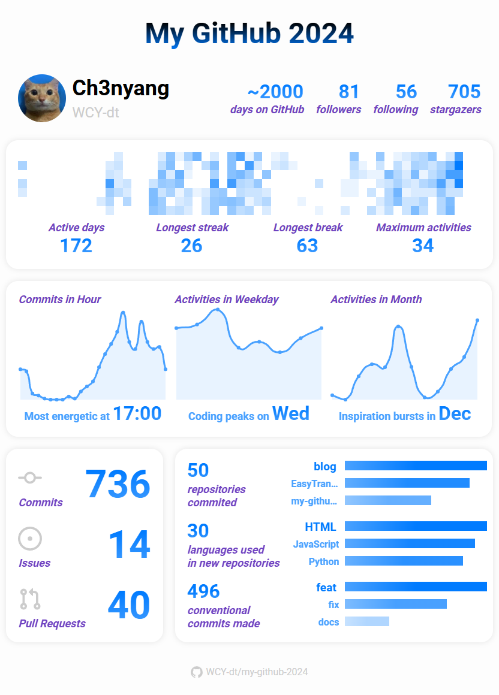

# my-github-2024

生成你的 GitHub 年度数据统计图。

[English](README.md) | 简体中文

## 示例



## 自行部署

1. 确保您已安装 Python 和 Pip：

    ```bash
    apt install python3 python3-pip -y
    ```

2. 克隆仓库：

    ```bash
    cd /var/www
    git clone -b online https://github.com/WCY-dt/my-github-2024.git
    cd my-github-2024
    ```

3. 配置环境变量：

    ```bash
    nano .env
    ```

    `.env` 文件内容形如：

    ```env
    CLIENT_ID=your_client_id
    CLIENT_SECRET=your_client_secret
    ```

4. 启动虚拟环境并安装依赖：

    ```bash
    pip3 install virtualenv
    virtualenv venv
    source venv/bin/activate
    pip3 install -r requirements.txt
    ```

5. 运行：

    ```bash
    python3 my-github-2024.py &
    ```

6. 安装并配置 Gunicorn：

    ```bash
    pip install gunicorn
    mv my-github-2024.service /etc/systemd/system
    ```

    启动服务：

    ```bash
    systemctl start my-github-2024
    systemctl enable my-github-2024
    ```

7. 配置 Nginx：

    ```bash
    apt install nginx -y
    mv my-github-2024 /etc/nginx/sites-available
    ```

    启用站点：

    ```bash
    ln -s /etc/nginx/sites-available/my-github-2024 /etc/nginx/sites-enabled
    nginx -t
    systemctl restart nginx
    ```

8. 访问 `http://your-domain.com` 即可查看效果。
